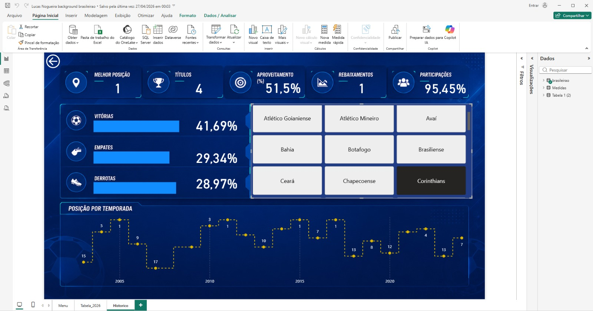
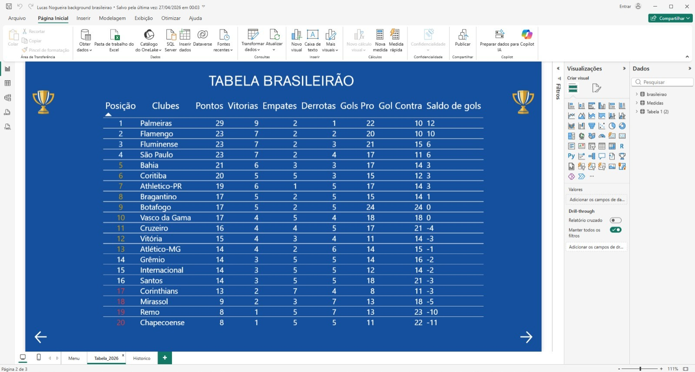

# Dashboard Brasileirão Power BI

Dashboard interativo desenvolvido para análise histórica do Campeonato Brasileiro.

## Dashboard Principal

---

## Tabela do Brasileirão

---

## Tecnologias Utilizadas

- Power BI
- DAX
- Modelagem de Dados
- Excel

---

## Indicadores

- Melhor posição
- Títulos
- Aproveitamento
- Participações
- Rebaixamentos
- Histórico por temporada

---

## Autor

Lucas Nogueira
